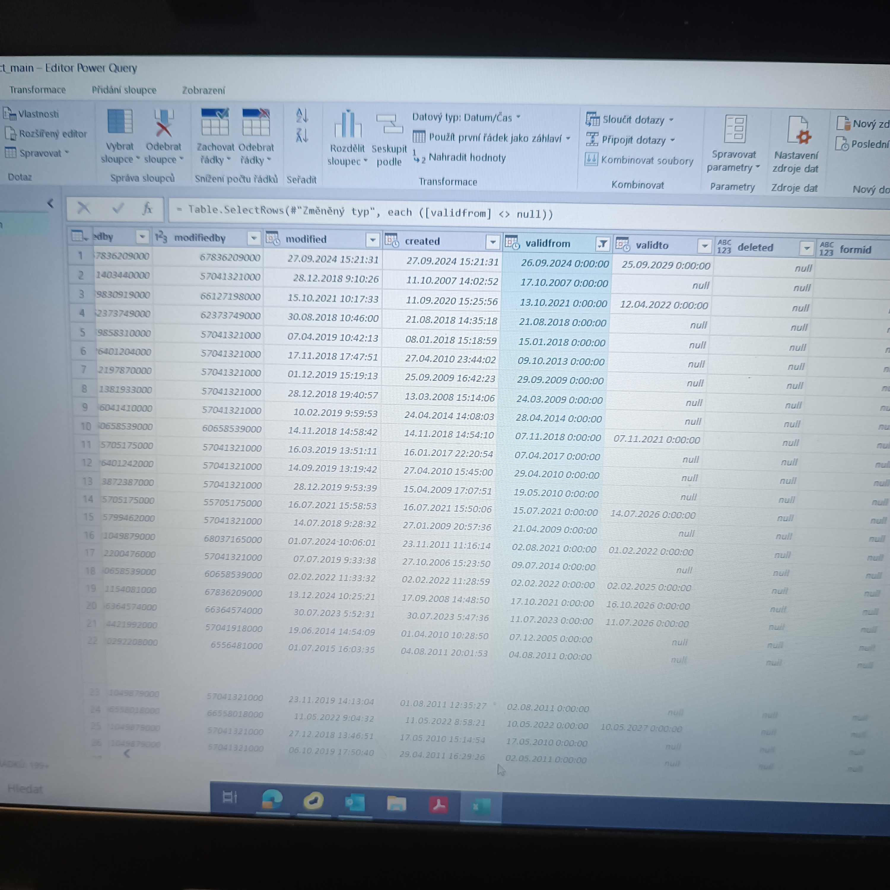
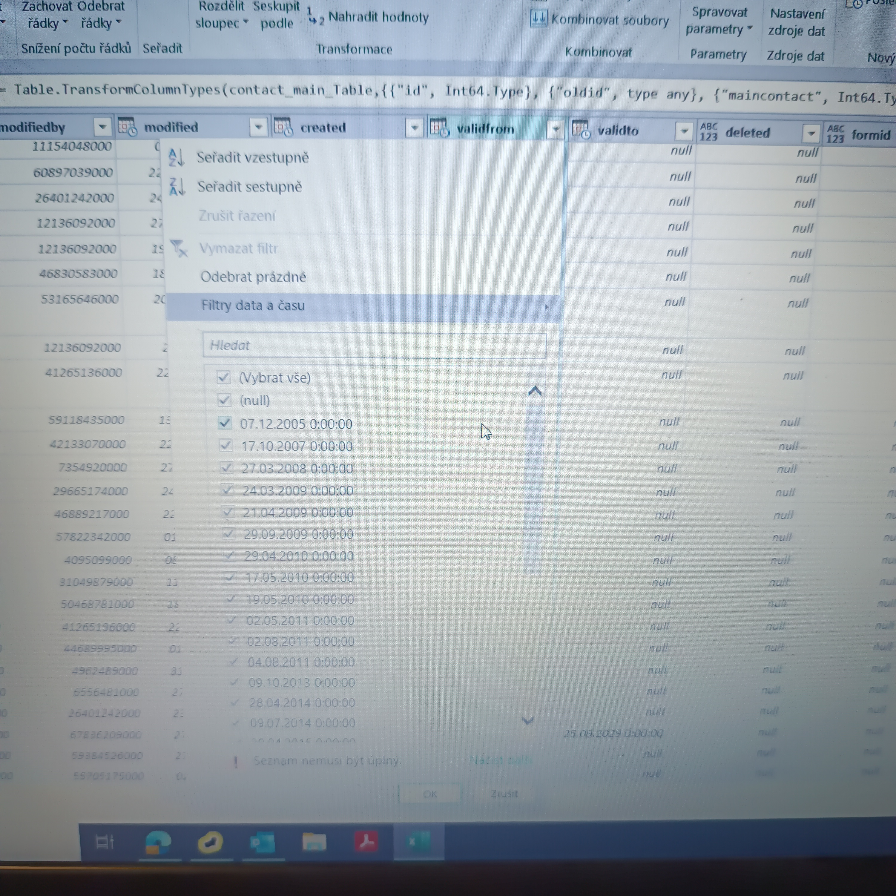

# CRM Data Cleanup

🛠 **GDPR consent verification and data migration between CRM systems**  
📅 Úprava a validácia dátumov, kontrola údajov a migrácia z CRM Atollon do CRM Recru.

---

## 🔍 Úloha
Kontrola a vyčistenie údajov pred migráciou dát z jedného CRM do druhého.  
Preverenie správnosti dátumov, manuálna validácia a úprava údajov podľa GDPR.

---

## 📸 Ukážky mojej práce

### ✅ Zadanie od Ivety
Screenshot of the assignment I received related to GDPR and CRM.

### 🧠 Pracujem na migrácii dát
Practical example of my work during the CRM data migration process.

### 🔧 Validácia dátumov v Power Query
Demonstration of how dates were validated and cleaned.

### 📊 Úprava dátumov v Power Query
Illustration of adjusting date formats before migration.

### 🧹 Kontrola údajov cez filtre v Exceli
Screenshot showing how GDPR consent was checked via CRM filters.

---

## 🔐 Poznámka
Dáta sú interné a anonymizované z dôvodu GDPR.  
Repozitár obsahuje len ilustračné obrázky a postupy bez citlivých údajov.

---

### 🗂️ Created by

**Denisa Pitnerová**  
Data quality check, GDPR compliance, CRM data migration  
📍 DRILL Management spol. s r.o.  
📅 August 2025  
🔒 The data is internal, so only illustrative screenshots are shown here – no sensitive or personal information is included.

**Denisa Pitnerová**  
Kontrola kvality dat, GDPR, migrace CRM údajů  
📍 DRILL Management spol. s r.o.  
📅 Srpen 2025  
🔒 Data jsou interní, proto jsou zde použity pouze ilustrativní screenshoty bez citlivých údajů.
   Úprava README so screenshottmi
