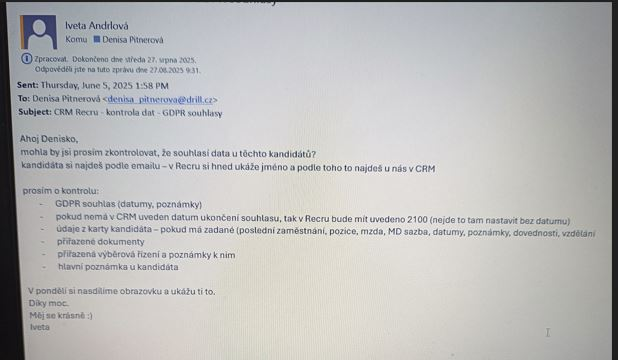
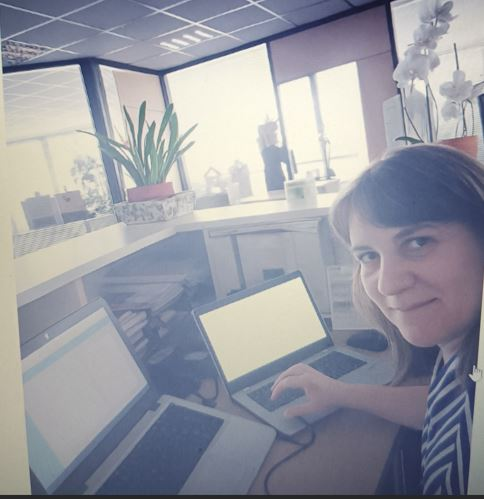
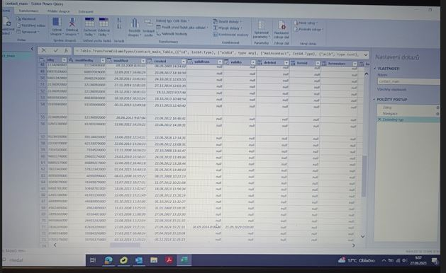

# CRM Data Cleanup

🛠 **GDPR consent verification and data migration between CRM systems**  
📅 Úprava a validácia dátumov, kontrola údajov a migrácia z CRM Atollon do CRM Recru.

---

## 🔍 Task / Úloha

**EN:**  
Data cleanup and validation before migration between CRM systems. Verifying GDPR consent, correcting date formats manually using Power Query and Excel filters.

**CZ/SK:**  
Kontrola a vyčištění údajů před migrací dat z jednoho CRM do druhého. Ověření správnosti dat, ruční validace a oprava údajů dle GDPR.

---

## 📸 Screenshots / Ukázky mojí práce

### 📩 Task assignment from Iveta / Zadání od Ivety  
  
Tento e-mail představuje konkrétní zadání na kontrolu souhlasu kandidátů se zpracováním údajů.

---

### 🧠 Working on data migration / Práce na migraci dat  
  
Validace a úprava údajů kandidátů dle požadavků GDPR v Power Query.

---

### 🔧 Date validation in Power Query / Validace dat v Power Query  
  
Úprava a oprava formátů datumů kvůli migraci.

---

### 📊 Date format fix in Power Query / Oprava formátu dat  
  
Manuální korekce a transformace do správného tvaru (den, měsíc, rok).

---

### 🧹 Checking GDPR consent in Excel filters / Kontrola přes filtry  
  
Přes filtry jsem ověřovala souhlas se zpracováním dat. Vše je nyní validní.

---

## 🗂️ Created by / Autor projektu

**Denisa Pitnerová**  
💼 Data quality check, GDPR compliance, CRM data migration  
🏢 DRILL Management spol. s r.o.  
📅 August 2025  

🔒 *The data is internal – only anonymized screenshots are shared. No sensitive information is visible.*

---
